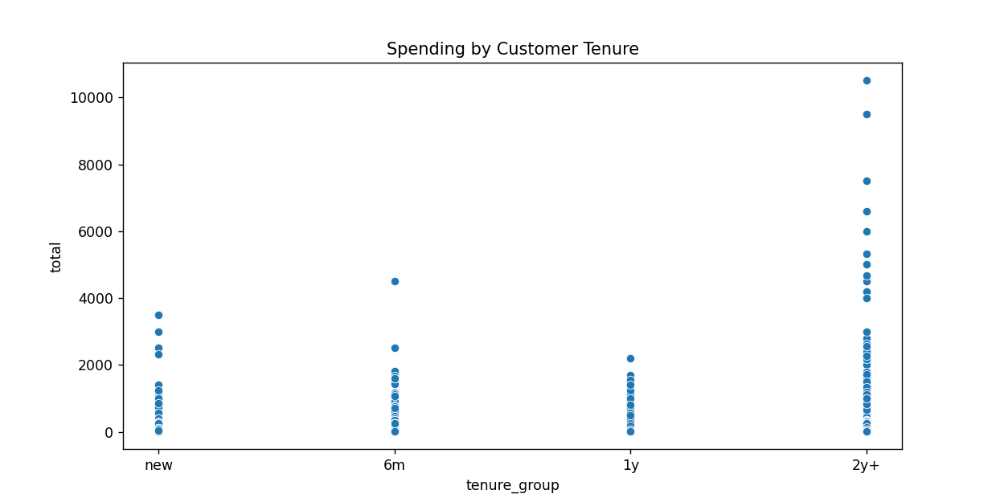
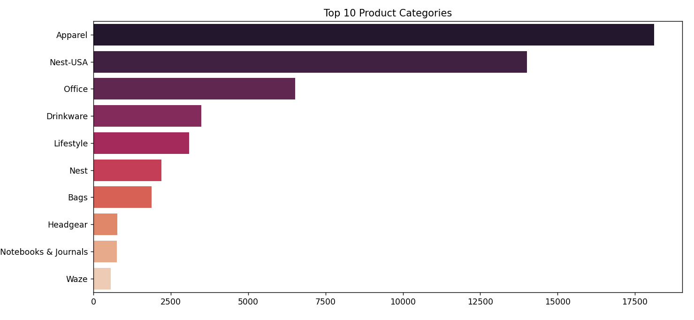
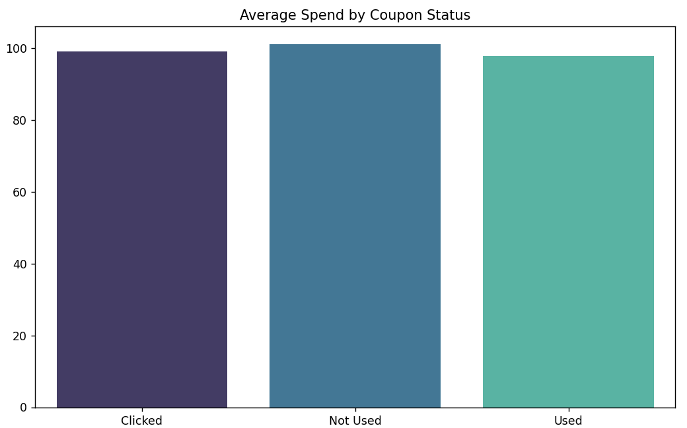
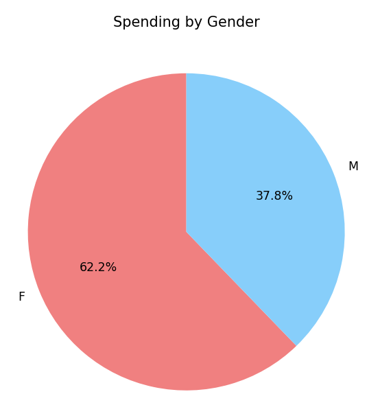
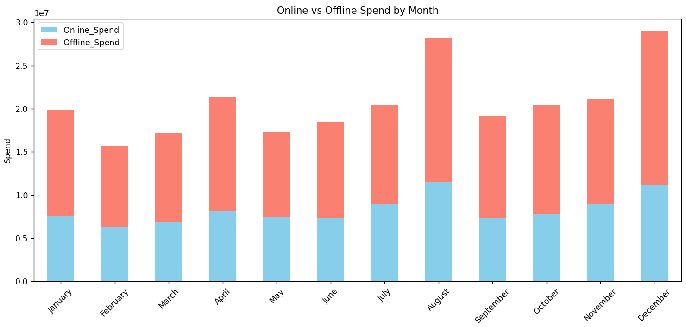

# 🛒 Customer Spend Analysis Dashboard

This project analyzes customer spending behavior based on transaction data. The goal is to identify patterns in purchase behavior across different demographics, discounts, time periods, and shopping channels.

## 📁 Dataset

The dataset used in this project (`file.csv`) contains customer-level transaction information, including:

- `Avg_Price`, `Quantity`, `Delivery_Charges`
- `Transaction_Date`, `Month`, `Tenure_Months`
- `Discount_pct`, `Coupon_Status`
- `Gender`, `Location`, `Product_Category`
- `Online_Spend`, `Offline_Spend`

## 🧾 Code Overview

The main script performs the following steps:

1. **Data Loading & Cleaning**: Reads the dataset, removes missing values and unnecessary columns.
2. **Feature Engineering**:
   - Calculates total spend for each transaction.
   - Converts dates and numeric months into human-readable formats.
   - Categorizes customer tenure and discount usage.
3. **Data Aggregation & Visualization**:
   - Generates scatter plots, bar charts, and pie charts to explore spending trends across various dimensions:
     - Tenure groups
     - Monthly trends
     - Product categories
     - Coupon usage
     - Gender-based spending
     - Geographic distribution
     - Online vs. Offline channel preference

Each chart helps uncover unique patterns in customer behavior.

## 📊 Visualizations

### 1. Spending by Customer Tenure

Shows how total spend varies with the duration of a customer’s relationship with the brand.



---

### 2. Total Monthly Spend

Displays the total spend across months to observe seasonality or monthly trends.


---

### 3. Top 10 Product Categories

Identifies the most frequently purchased product categories.



---

### 4. Average Spend by Coupon Status

Compares the spending habits of users who use coupons vs those who don't.



---

### 5. Gender-Based Spending Distribution

Pie chart showing the overall distribution of spending between genders.



---

### 6. Top 10 Locations by Transactions

Highlights the locations with the highest number of transactions.


---

### 7. Online vs Offline Spend by Month

A stacked bar chart showing online vs offline spending across months.



---

## 🧰 Technologies Used

- Python 3
- Pandas
- Matplotlib
- Seaborn
- NumPy

## 📦 Setup Instructions

1. Clone this repo:
   ```
   git clone https://github.com/yourusername/customer-spend-analysis.git
   cd customer-spend-analysis
   ```

2. Install dependencies:
   ```
   pip install -r requirements.txt
   ```

3. Place your `file.csv` dataset in the project folder.

4. Run the script:
   ```
   python analysis.py
   ```

## 📁 Folder Structure

```
├── analysis.py
├── file.csv
├── images/
│   ├── tenure_spend.png
│   ├── monthly_spend.png
│   ├── ...
├── README.md
└── requirements.txt
```

## ✍️ Author

Your Name – [your.email@example.com](mailto:your.email@example.com)

---

## 📌 Notes

- Make sure the `Month` column contains valid numeric month values (1–12).
- Plots are automatically saved inside the `images/` folder (if enabled in the script).
